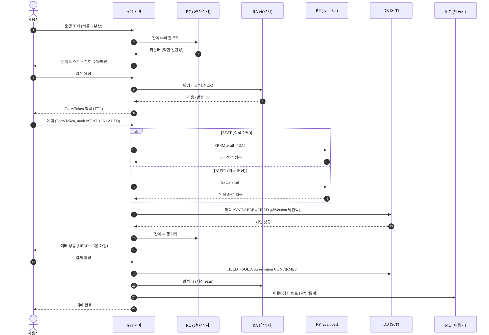
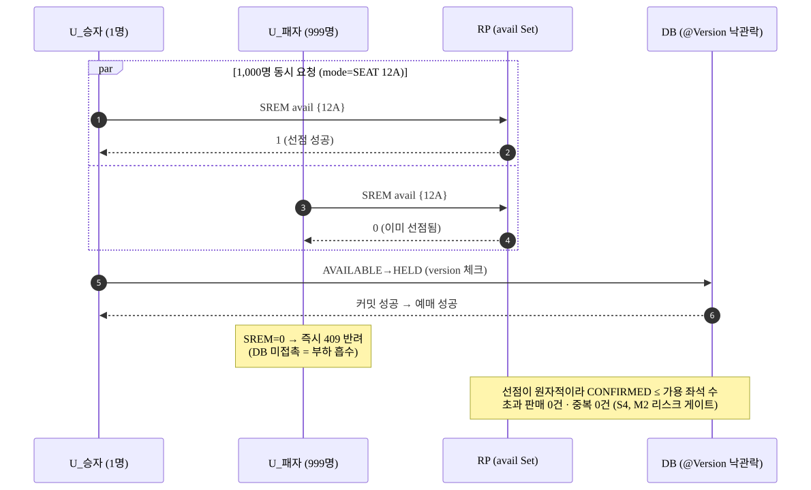
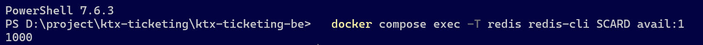
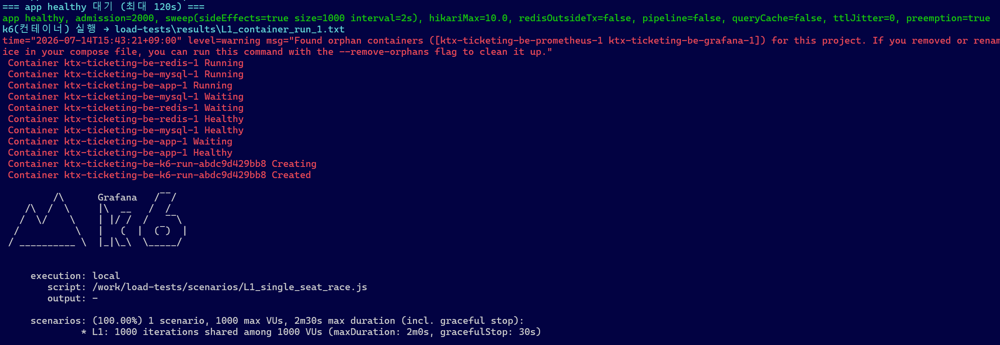
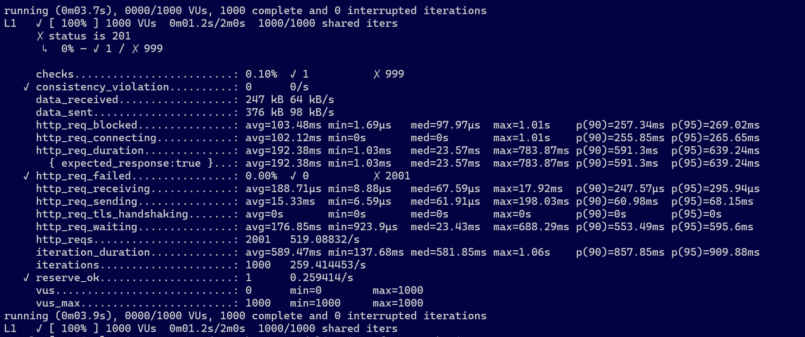
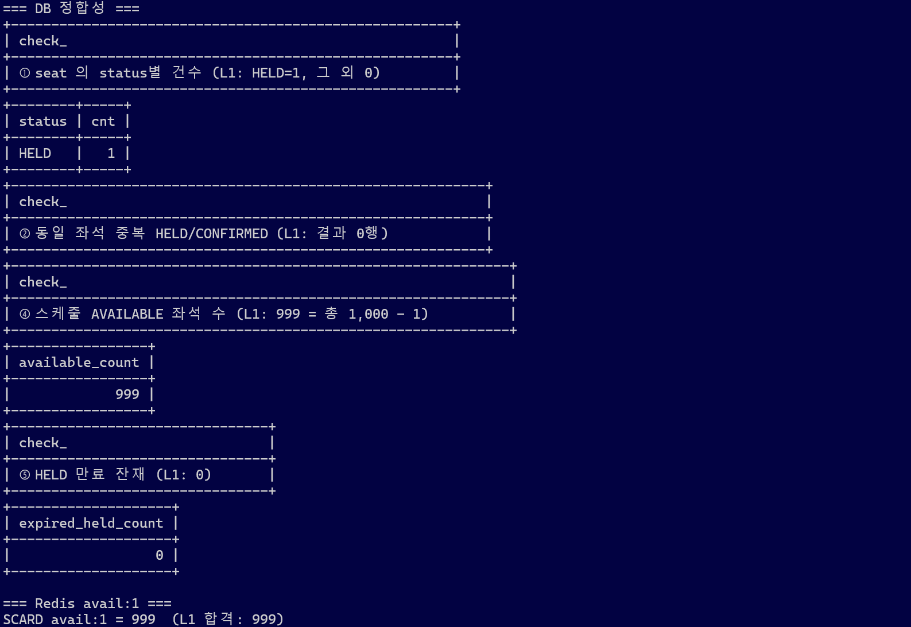
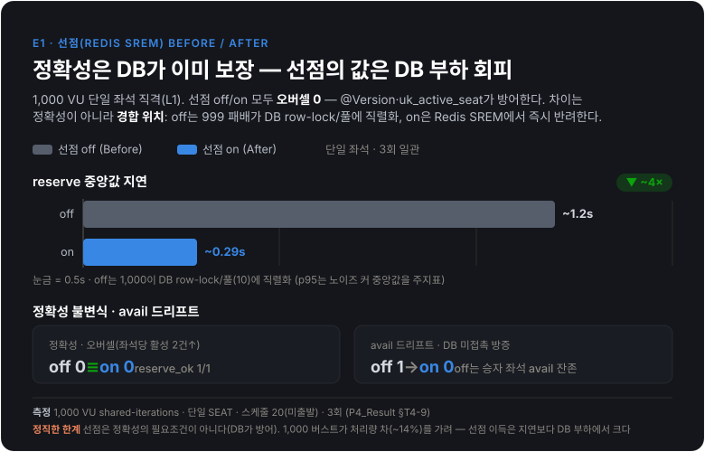
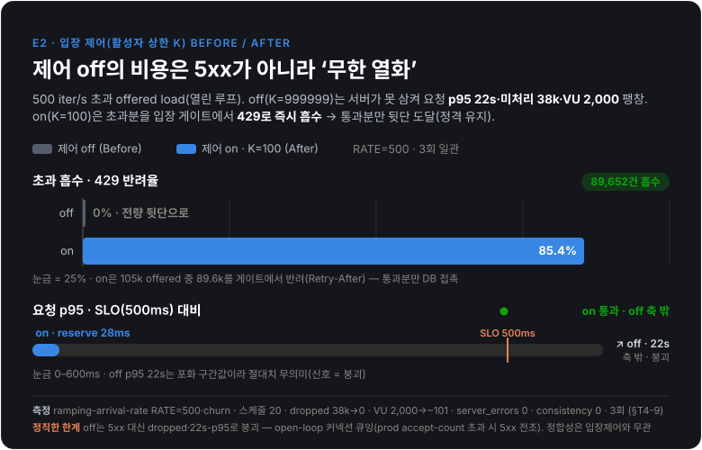
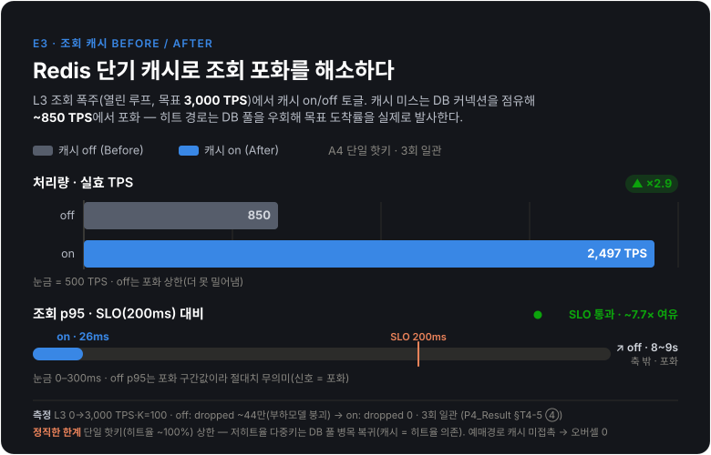

# KTX Ticketing

> **명절 KTX 표 예매의 대규모 동시접속·매진 경쟁 문제를, 정합성을 보장하는 선착순 예매로 푼다.**

명절·연휴에 수만 명이 동시에 같은 좌석을 예매하려 할 때 발생하는 **초과 판매(oversell)·중복 예매·좌석 재고 깨짐**을 막고, 그 정합성과 성능을 **부하 테스트와 Before/After 수치로 증명**하는 것을 목표로 하는 포트폴리오 프로젝트다.

CRUD 기능 수가 아니라, **N명이 한 좌석을 경합할 때 정확히 1명만 성공하게 만드는 동시성·정합성 엔지니어링**이 이 프로젝트의 핵심이다.

---

## 왜 이 문제인가

명절마다 KTX 예매창에서 좌석을 골라 결제 직전에 "이미 매진" 처리되거나, 새로고침 지옥을 겪으며 *왜 동시 예매가 이렇게 깨지는가*가 궁금했다. 이 프로젝트는 그 질문을 공학적으로 정면 돌파한다:

- **문제 정의** — N명이 같은 좌석을 동시에 예매 시도할 때, 단 1명만 성공하고 좌석 재고가 정확히 차감되어야 한다.
- **접근** — 분산 락 + DB 낙관 락으로 경합을 제어하고, 비가시 입장 제어로 피크 트래픽을 흡수한다.
- **증명** — 모든 설계 결정에 트레이드오프 근거를 남기고, 부하 테스트로 SLO 충족 여부를 수치화한다.

---

## 핵심 목표

| 우선순위 | 목표 | 기준 |
|---------|------|------|
| **최우선** | 정합성 | 동시 1,000 요청 / 단일 좌석에서 **초과 판매 0건, 중복 예매 0건** (M2 리스크 게이트) |
| 높음 | 응답 성능 | 예매 API **p95 ≤ 500ms / p99 ≤ 1s**, 운행 조회 **p95 ≤ 200ms** |
| 높음 | 처리량 | 동시 **1,000 VUser에서 ≥ 200 TPS** |
| 중간 | 가용성 | 부하 중 5xx **< 1%** (의도된 429/503 제외) |
| 결과물 | 증명 | E1~E3 **Before/After 수치** + 모든 SLO에 "왜 이 값인가" 근거 문서화 |

---

## 아키텍처 결정

> **주 경로 = Plan A: Redis 동기 예매 + 비가시 입장 제어.**
> 메시지 큐는 핵심 예매 경로가 아니라 **비동기 사이드**(결제 결과·만료·통계 이벤트)에만 도입한다.

### 결정 근거 (Redis 동기 vs 메시지 큐 비동기)

| 기준 | Plan A (Redis 동기) — **채택** | Plan B (MQ 비동기) |
|------|-------------------------------|--------------------|
| 정합성 보장 | 분산 락 + 낙관 락 | 파티션 직렬화 |
| 응답 UX | 단순 (요청-응답 1회) | 복잡 (추적/폴링) |
| 운영 복잡도 | 낮음 | 높음 |
| 학습/어필 | **락 설계·경합 제어** | 스트림·백프레셔·멱등성 |

KTX 예매의 본질 난제는 "같은 좌석 동시 점유 제어"이므로, **분산 락으로 정면 돌파**하는 것이 학습·어필 가치가 가장 크다. 실제 KTX 앱처럼 **순번을 노출하지 않는 입장 제어**가 도메인에도 충실하다. (상세: [docs/KTX_Ticketing_Architecture_and_Verification_Goals.md](docs/KTX_Ticketing_Architecture_and_Verification_Goals.md))

### 핵심 메커니즘

- **단일 원자 선점 지점 = Redis Set `avail:{schedule_id}`** — 직접 선택은 `SREM`(반환 1 = 승리), 자동 배정은 `SPOP`. 승자만 DB 상태 전이를 수행하고, 취소/만료는 `SADD`로 좌석을 되돌린다.
- **좌석 상태 기계** — `AVAILABLE → HELD → SOLD`, `HELD`는 TTL(5분) 만료 시 스케줄러가 `AVAILABLE`로 복구.
- **비가시 입장 제어** — Redis 활성자 카운터로 동시 활성 세션을 상한 `K`로 제한, 초과 시 `429/503 + Retry-After`. 보이는 대기열은 없다.
- **2단 일관성 모델** — *조회/표시*(운행 리스트·잔여석·매진)는 빠르고 **결과적 일관성**(staleness ≤ 2s), *예매 확정*은 락 임계영역 안에서만 결정되는 **강한 일관성**. **DB가 SoT**, Redis는 빠른 게이트.

> **인증/인가는 이번 범위 외(out of scope).** 이 프로젝트의 평가 핵심은 동시성·정합성이며, 사용자 신원은 입장 토큰(`EntryToken`)으로만 다룬다. 실제 로그인/회원 인증(Spring Security 등)은 부하 테스트를 단순하게 유지하기 위해 의도적으로 제외했다.

### 시스템 아키텍처



> 조회는 Redis 기반 약한 일관성(staleness ≤ 2s), 예매 확정은 DB 임계영역 안 강한 일관성. DB가 SoT이고 Redis는 빠른 게이트 — 부하 후 `ReconciliationService`가 DB로 수렴시킨다. (다이어그램 소스: [docs/images/](docs/images/architecture.md))

### 예매 흐름 (조회 → 입장 → 예매 → 확정)



### 동시성 경합 — 같은 좌석 1,000명 → 초과 판매 0건 (프로젝트의 심장)



> **이중 방어선**: ① Redis `SREM` 원자 선점이 패배 999건을 DB 앞단에서 즉시 반려(부하 흡수), ② DB `@Version` 낙관락 + `uk_active_seat`가 최종 정합성 방어. 선점을 꺼도(E1 Before) 오버셀은 0 — 선점의 값은 *정확성*이 아니라 *처리 비용*이다(아래 E1 실험).

#### 실측 증거 — 부하 전 1,000석 → 1,000명 동시 → 성공 1건 → 부하 후 999석

> L1 시나리오(단일 좌석 1,000 VU 동시 경쟁)를 냉간 1회 실행한 실측. 위 시퀀스가 설계라면, 아래는 그 설계가 실제로 oversell=0 을 지킨 물증이다.

**① 부하 전** — Redis 선점 풀에 좌석 1,000석 적재 완료(깨끗한 출발선):



**② 부하 발사** — 컨테이너 k6 로 1,000 VU 가 같은 좌석을 동시 공격(호스트 k6 의 NAT 오염 회피):



**③ k6 결과** — 성공 정확히 1건, 진짜 1,000 동시(`http_reqs=2000`), 5xx 누수 0, 정합성 audit 통과:



**④ DB · Redis 사후 검증** — SoT(DB)에서 HELD=1·중복 0·AVAILABLE 999·만료잔재 0, Redis `SCARD=999`(드리프트 0):



> **1000 → 999, 정확히 −1.** k6 요약(성공 1건)과 DB·Redis 실측(999석 잔존)이 교차 검증돼 **초과 판매 0건·중복 0건**(S4·M2 리스크 게이트)이 애플리케이션과 스토리지 양쪽에서 증명된다.

---

## SLO (검증 목표)

| # | 지표 | 목표 기준 | 근거 | 측정값 (P4) |
|---|------|-----------|------|-------------|
| S1 | 예매 API 응답 | p95 ≤ 500ms, p99 ≤ 1s | Google SRE 일반 웹 SLO 관례 | **p95 348~408ms ✅** (L2 3회) |
| S2 | 운행 리스트/매진 조회 | p95 ≤ 200ms | 모든 사용자의 진입점, 읽기 多 | 캐시 on **p95 ~26ms ✅** (L3·E3 핫키; off 8~9s) — 저히트율 다중키는 초과(히트율 의존) |
| S2b | 매진/잔여석 표시 staleness | ≤ 2초 | 약한 일관성 허용 범위 | **캐시 TTL 1s ≤ 2s ✅** (설계 상한, E3) |
| S3 | 처리량 | 동시 1,000 VUser에서 ≥ 200 TPS | 명절 피크 가정 | **833~863 TPS ✅** (목표의 4배+, L2) |
| S4 | **정합성 (최우선)** | **초과 판매 0건 / 중복 예매 0건** | 예매 시스템 절대 조건 | **oversell 0 / 중복 0 ✅** (L1 단일좌석 1,000 경쟁 3회 일관) |
| S5 | 가용성 | 부하 중 5xx < 1% (의도된 429/503 제외) | 피크에도 서비스 유지 | **0.03~0.04% ✅** (L2) |
| S6 | 임계점 | 시스템이 무너지는 동시 사용자 수를 숫자로 파악 | "어디서 무너지는가" | **safe 예매 ~150 TPS·천장 ~189 TPS → K=100 확정 ✅** (L5b) |

> 측정값은 [docs/results/P4_Result.md](docs/results/P4_Result.md)의 실측 인용. **L1~L6 부하 시나리오와 필수
> 실험 E1·E2·E3 의 Before/After 짝이 모두 완료**됐다. 기준값은 업계 레퍼런스(Google SRE 등)를 참조해
> 직접 정의한 뒤 실측으로 검증했으며, 핵심은 숫자 크기가 아니라 **"왜 이 값인가"를 설명할 수 있는 것**이다.
> (시나리오 L1~L6: [docs](docs/KTX_Ticketing_Architecture_and_Verification_Goals.md))
>
> **조회 p95 개선은 측정이 드러낸 설계 이슈를 정면 해결한 결과** — L2 혼합부하에서 드러난 조회 지연(~0.9s)을
> 2-tier 일관성 모델의 조회 캐시(E3)로 우회해 **핫키 p95 26ms(SLO 통과)**를 달성했다("측정 후 최적화" 원칙,
> 아래 C4). 다만 캐시는 **히트율 의존** — 저히트율 다중 키에선 DB 풀이 병목으로 복귀함을 함께 규명했다(정직한 한계).

---

## Before / After 실험 (포트폴리오 하이라이트)

| 실험 | Before | After | 보여줄 것 | 상태 |
|------|--------|-------|-----------|------|
| **E1** 동시성 제어 | 선점 OFF (`booking.preemption.enabled=false`) | 선점/락 적용 | 선점의 값 = **DB 부하 회피** (정확성은 양쪽 0) | **✅ 완료: oversell 양쪽 0(정확성 동일) · reserve 중앙값 ~1.2s → ~0.29s (~4×↓) · availDrift off=1/on=0** (L1 단일좌석 1,000, 3회) |
| **E2** 입장 제어 | 제어 없음 (`max-active` 무제한) | 활성자 상한 K=100 | **무경계 열화** → 빠른 429 반려 | **✅ 완료: off p95 22s·dropped 38k·VU 2,000 팽창 → on 429 85.4% 흡수·dropped 0·reserve p95 ~28ms** (L4 open-loop RATE=500, 3회) |
| **E3** 조회 캐시 | 캐시 off (매 요청 DB 집계) | Redis 단기 캐시 | 조회 p95·DB 부하 대폭 감소 | **✅ 완료: ~850 TPS·p95 8~9s → 2,497 TPS·p95 26ms·dropped 0** (핫키, L3 3회 일관) |
| E4 (선택) | Redis 동기 | MQ 비동기 | 처리량/지연/정합성 수치 비교 | 선택 (P5) |







> E1·E2·E3는 필수 — **셋 다 Before/After 짝 완성**. 각 실험은 위 수치 + 한 줄 해석으로 정리한다.
> **E1의 정직한 결론**: 선점을 꺼도 `@Version` 낙관락·DB 유니크가 오버셀을 막아 **정확성은 양쪽 0** — 선점의
> 값은 *정확성의 필요조건*이 아니라 **DB 부하 회피**다(패배 999건이 Redis 앞단에서 즉시 반려돼 reserve 중앙값
> ~4×↓). **E2**: 입장 제어 off 의 비용은 5xx 폭증이 아니라 **무경계 열화**(p95 22s·VU 2,000 팽창·38k drop) —
> 제어 on 은 초과분 85.4%를 429로 흡수해 뒷단을 정격으로 보호한다(reserve p95 ~28ms). 두 실험 모두
> "정확성은 이미 DB 가 보장, 성능·가용성은 앞단 게이트가 지킨다"는 2-tier 서사를 실측으로 뒷받침한다.
> 추가 실험(E5 가상 스레드·E6 분산 락 라이브러리·E7 선점 백엔드)은 가산 항목으로 P4 백로그에 정의돼 있다.

---

## AI 활용 방식 — "끌려가지 않는" 워크플로우

이 프로젝트는 AI(Claude Code)와 협업해 구현했다. 핵심은 *AI로 무엇을 만들었나*가 아니라
**AI를 어떤 규율로 통제했는가**다. AI를 코드 생성기가 아니라, 사람이 게이트를 쥔 협업 파트너로 운용했다.

### 모든 task는 3개의 사람 게이트를 통과한다

```
Task 추출 → ① 계획 승인 게이트 → 소단위 구현 루프(코드 → ② 테스트 유효성 게이트 → 테스트 → ③ 커밋 승인 게이트) → 결과 보고서 → 체크리스트
```

| 게이트 | 규율 | "끌려가지 않음"의 의미 |
|--------|------|------------------------|
| ① **계획 승인** | 실행 계획을 사람이 승인하기 전엔 코드를 쓰지 않는다. 락된 아키텍처 결정([CLAUDE.md](CLAUDE.md)) 위반 여부를 사전 점검. | AI가 임의로 구현 방향을 정하지 못한다. 방향 수정은 코드 작성 *전에* 끝낸다. |
| ② **테스트 유효성** | 테스트를 쓰기 *전에* "이게 비즈니스 로직/설계 결정을 검증하는가?"를 먼저 묻는다. Java 언어 동작·단순 getter·H2 스키마 같은 무의미한 커버리지는 거부한다. | 커버리지 숫자에 끌려가 의미 없는 테스트를 양산하지 않는다. |
| ③ **커밋 승인** | 커밋 메시지 초안을 사람이 승인한 뒤 실행. Phase 전체를 한 커밋으로 묶지 않고 논리적 소단위로 분리. | 커밋 단위·이력을 사람이 통제한다. |

(상세: [docs/Dev_Workflow.md](docs/Dev_Workflow.md))

### 이 규율이 실제로 잡아낸 것 (워크플로우의 산물)

규율은 장식이 아니다. 다음은 그 게이트들이 실제로 작동한 증거다:

- **측정 후 최적화 원칙 → 추측성 최적화 차단.** 만료 sweep 벌크 최적화(T4-13)는 "느릴 것 같다"가 아니라
  *L6 soak에서 sweep이 병목으로 측정될 때만* 착수하도록 트리거 조건을 못박았다. AI의 "최적화해드릴까요"에
  끌려가지 않고, 근거(실측)가 생긴 뒤에만 손댄다.
- **AI 결과를 그대로 믿지 않고 직접 검증.** 1,000 동시 부하에서 60~78%가 연결 거부되던 현상을, "원인은 X"라는
  추정으로 끝내지 않고 가설별 격리 실험으로 규명했다 — 진짜 원인은 앱/Tomcat이 아니라 **Docker Desktop의
  NAT 포화**였다([K6 포트 고갈 트러블슈팅](docs/notes/K6_Port_Exhaustion_Troubleshooting.md)). 정합성 자동
  게이트(`/internal/consistency`)는 L6에서 **timezone skew라는 환경 의존 실결함을 자동 검출**했다(오버셀이
  아님을 `availDrift`·`statusViolation`=0으로 동시에 확인).
- **검증 흔적을 남긴다.** 모든 Phase 결과는 [docs/results/P*.md](docs/results/)에 측정 환경·수치·해석·트레이드오프와
  함께 기록된다. 측정 수치는 코드가 아니라 *실측자가 직접* 기입한다(시나리오 정비는 코드, 측정 실행은 사람 책임).

> 면접 관점: 위 항목들은 "AI에게 무엇을 시킬지 스스로 판단했는가 / 끌려가지 않았는가 / 어디서 검증했는가"
> ([평가 루브릭](docs/Portfolio_Project_Evaluation_Criteria.md) C4)에 대한 코드·문서 근거다.

---

## 다른 포트폴리오와 구분되는 관점

흔한 "선착순 예매" 클론과 이 프로젝트의 차이는 **실제 KTX(코레일) 앱의 예약 흐름을 의식적으로 재설계**한 데 있다:

- **보이지 않는 입장 제어** — 콘서트 티켓팅처럼 대기 순번을 노출하지 않는다. 서버가 활성 세션을 상한 `K`로
  제한하고 초과분은 `429/503 + Retry-After`로 흡수한다(`WaitingQueueEntry` 같은 큐 번호 엔티티가 의도적으로 없다).
  이는 실제 KTX 앱의 UX에 충실하면서, "대기열을 보여주지 않고도 피크를 견딘다"는 다른 난제를 만든다.
- **단일 원자 선점 지점** — 직접 선택(`SREM`)과 자동 배정(`SPOP`)이 하나의 Redis Set을 공유해, 두 예매 모드가
  같은 재고에서 정확히 경합한다. 락을 여러 군데 흩뿌리는 대신 선점을 한 점에 모았다.
- **2-tier 일관성의 명시적 분리** — 조회/표시는 약한 일관성(빠름), 예매 확정은 강한 일관성(정확). 둘을 섞지 않고
  분리한 것 자체가 설계 결정이며, 그 경계를 SLO(S2 staleness ≤ 2s vs S4 oversell 0)로 측정 가능하게 했다.

(실제 코레일 예약 방식 대비 개선점 상세 정리는 [Task Checklist](docs/KTX_Ticketing_Task_Checklist.md) T7-2 참조)

---

## 기술 스택

| 항목 | 결정 |
|------|------|
| 앱 프레임워크 | Spring Boot 4.0 (Java 25) |
| 빌드툴 | Gradle 9.5 (Kotlin DSL) |
| DB | MySQL 8.0 |
| Cache / 선점 | Redis 7 |
| 분산락 | Redisson 4.4 |
| 로드테스트 | k6 (우선), nGrinder (대안) |
| 통합 테스트 | Testcontainers (MySQL/Redis 자동 기동) |
| CI | GitHub Actions |

---

## 빌드 / 실행

```bash
# 로컬 전체 기동 (앱 + MySQL + Redis)
docker compose up --build

# 로컬 개발 (DB/Redis만 Docker, 앱은 IDE에서 실행)
docker compose up mysql redis
# → IDE에서 --spring.profiles.active=local 로 KtxTicketingApplication 실행

# 빌드 / 테스트
./gradlew build
./gradlew test

# 실행 가능한 JAR
./gradlew bootJar
```

> 통합 테스트는 Testcontainers가 MySQL/Redis를 자동 기동하므로 로컬 인프라가 떠 있지 않아도 된다 (Docker 데몬은 필요).

### 부하 테스트 (oversell=0 재현)

이 프로젝트의 핵심 증거는 부하 테스트로 재현한다. **L1(단일 좌석 1,000 동시 경쟁)이 가장 중요** — 정합성 게이트다. 실행은 **컨테이너 k6 러너**(`Run-Scenario-Container.ps1`)로 한다 — reset+재시드+health+k6+정합성 audit 을 1회 흐름으로 처리한다.

```powershell
# 앱+MySQL+Redis 기동 후, 정합성 검증(L1)부터. -PostRunCheck 로 부하 후 DB·Redis audit 동반.
pwsh load-tests/scripts/Run-Scenario-Container.ps1 `
  -Scenario load-tests/scenarios/L1_single_seat_race.js -PostRunCheck -Iterations 1
#   → reserve_ok=1 · consistency_violation=0 · oversell 0 (부하 전 SCARD 1000 → 후 999)

# 다른 시나리오도 -Scenario 만 교체 (L2 정상 혼합 부하 / L4 입장 제어 초과=E2 등)
```

> **호스트 k6 가 아니라 컨테이너 k6 로 실행**해야 한다 — 호스트 k6 는 Windows NAT 포화로 연결 거부가 섞여 "진짜 1,000 동시" 전제가 깨진다(이 트러블슈팅 자체가 딜리버러블). 러너가 same-network 컨테이너 k6 로 이를 우회한다. 시나리오·러너·트러블슈팅 상세: [load-tests/README.md](load-tests/README.md).

---

## 결과물 현황

면접관이 직접 확인 가능한 형태로 다음을 갖춘다 ([평가 루브릭](docs/Portfolio_Project_Evaluation_Criteria.md) ④):

| 항목 | 상태 | 의존 task |
|------|------|-----------|
| GitHub 소스코드 | ✅ (이 레포) | — |
| README (문제정의·아키텍처·트레이드오프·성능) | ✅ 문제정의·아키텍처·트레이드오프·전 실험(E1~E3)·SLO 수치·E1~E3 차트·아키텍처/시퀀스 다이어그램 반영 | — |
| 배포 URL | ⏸️ 의도적 생략 — 핵심 증거(oversell=0)는 UI로 재현 불가, 부하테스트+audit 스크린샷·Swagger 라이브로 갈음 (아래 근거) | T6-3b |
| 아키텍처/시퀀스 다이어그램 이미지 | ✅ 완료 (아키텍처 + 예매 happy path + 동시성 경합, `docs/images/`) | T6-2 |
| 동작 증거 — 정상 흐름 | ✅ Swagger UI 라이브 데모로 대체 (`/swagger-ui.html`, 조회→입장→예매→확정→취소 직접 호출) | T6-3a/T6-4 |
| 동작 증거 — 동시성 oversell=0 + 부하 결과 | ✅ 스크린샷 서사 4장(1000→발사→성공1건→999) 임베드, 위 "실측 증거" 절 | T6-5 |

> **배포 URL 을 의도적으로 생략한 이유** — 이 프로젝트의 핵심 증거는 *동시 1,000 요청에서 oversell=0*
> 인데, 이는 배포된 URL 에 접속해 버튼을 눌러본다고 재현되지 않는다(단일 사용자 클릭으로는 경합이
> 발생하지 않음). 정합성은 **k6 부하 + DB/Redis audit** 로만 증명되며, 그 증거는 위 "실측 증거" 절의
> 스크린샷 서사로 확보했다. 정상 흐름의 "직접 확인 가능한 형태"(평가기준 ④)는 **Swagger UI 라이브
> 데모**로 충족한다. 즉 FE 없는 백엔드 배포는 *체크박스 하나*를 더할 뿐 핵심 역량을 증명하지 못하므로,
> 배포 인프라 비용 대비 실익이 낮다고 판단해 생략했다(개발계획상 배포는 `Should`, "차단 시 스크린샷
> 보완" 방침). 시각적 데모가 필요하면 단일 정적 HTML 좌석 그리드를 P7(가산·제출 후)로 이월해 둔다.

---

## 문서 맵 (`docs/`)

이 순서로 읽으면 시스템을 이해할 수 있다 (문서는 한국어, 파일명은 영어):

1. [KTX_Ticketing_Project_Goals.md](docs/KTX_Ticketing_Project_Goals.md) — 문제 정의, 평가 기준, SLO 목표
2. [KTX_Ticketing_Architecture_and_Verification_Goals.md](docs/KTX_Ticketing_Architecture_and_Verification_Goals.md) — Redis vs MQ 결정, SLO S1~S6, 시나리오 L1~L6, 실험 E1~E4
3. [KTX_Ticketing_Design.md](docs/KTX_Ticketing_Design.md) — 도메인 모델, 동시성 전략, 입장 제어, API 초안
4. [KTX_Ticketing_Workflow.md](docs/KTX_Ticketing_Workflow.md) — 사용자 여정 시퀀스 (정상/예외/경합 경로)
5. [KTX_Ticketing_Development_Plan.md](docs/KTX_Ticketing_Development_Plan.md) — 7주 단계별 계획 (P0~P6), 마일스톤 M1~M5
6. [KTX_Ticketing_Task_Checklist.md](docs/KTX_Ticketing_Task_Checklist.md) — 태스크 트래커
7. [KTX_Ticketing_Performance_Test.md](docs/KTX_Ticketing_Performance_Test.md) — 부하 테스트 시나리오 (k6 / nGrinder)
8. [Portfolio_Project_Evaluation_Criteria.md](docs/Portfolio_Project_Evaluation_Criteria.md) — 평가 루브릭
