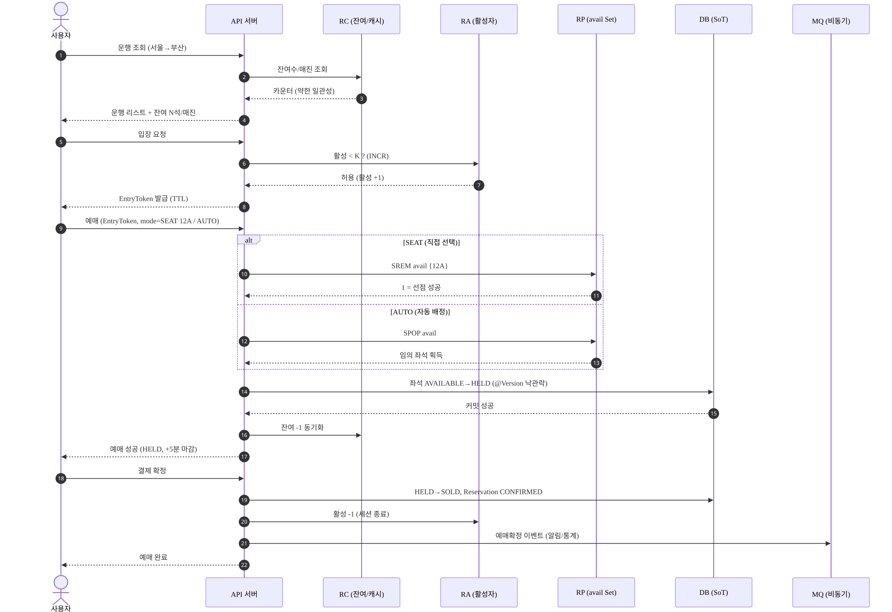
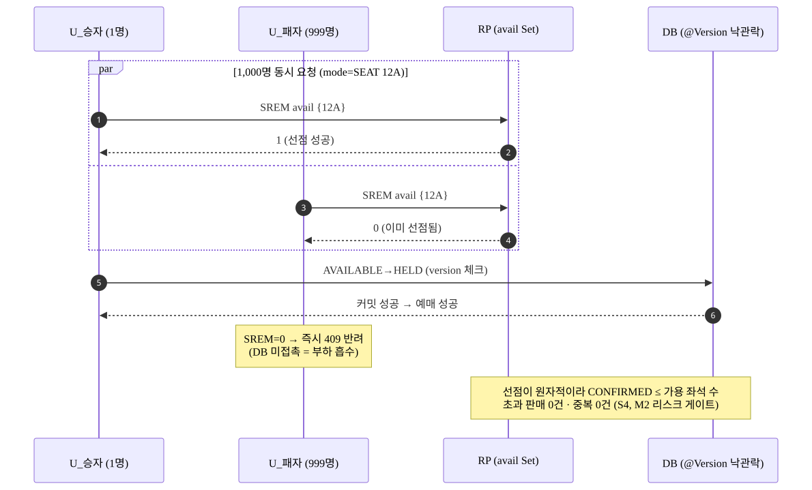

# 아키텍처 다이어그램 (T6-2)

> 출처: `KTX_Ticketing_Design.md`·`KTX_Ticketing_Workflow.md`·`CLAUDE.md`(locked decisions)
> 용도: README 임베드 · 영상 캡션 근거.
> 소스(`.mmd`)를 mmdc 로 SVG 렌더(배경 투명 — 라이트/다크 뷰어 모두 대응). 소스 수정 시 재생성:
> `cd docs/images && npx -y @mermaid-js/mermaid-cli -i <name>.mmd -o <name>.svg`

---

## 1. 시스템 아키텍처 — 2-tier 일관성 + 단일 원자 선점점

> 소스: [`architecture.mmd`](architecture.mmd)

**핵심 설계 포인트**
- **단일 원자 선점점 = `avail:{schedule}` Set.** SEAT=`SREM`(1이면 승), AUTO=`SPOP`. 두 모드가 같은 Set 공유 → 한 좌석을 둘이 가져갈 수 없음.
- **2-tier 일관성**: 조회/표시는 Redis 기반 *약한 일관성*(stale ≤ 2s, 매진은 보수적), 예매 확정은 DB 임계영역 안에서만 결정되는 *강한 일관성*.
- **DB = SoT.** Redis 카운터/Set 은 빠른 게이트일 뿐, 부하 후 `ReconciliationService` 가 DB 로 수렴시킴.
- **보이지 않는 입장 제어**: 대기 순번 없음. 활성자 < K 면 `EntryToken`(TTL) 발급, 초과 시 `429/503 + Retry-After`.

---

## 2. 시퀀스 — 예매 Happy Path (조회→입장→예매→확정)

> 소스: [`sequence-happy-path.mmd`](sequence-happy-path.mmd)

---

## 3. 시퀀스 — 동시성 경합 (같은 좌석 1,000명 → oversell 0)

> 프로젝트의 심장. `mode=SEAT(12A)` 1,000 동시 요청 → **단 1명만 성공, oversell 0건**(S4).

> 소스: [`sequence-concurrency.mmd`](sequence-concurrency.mmd)

**이중 방어선**
1. **1차 = Redis `SREM` 원자 선점** — 999명을 DB 앞단에서 즉시 반려(부하 흡수).
2. **2차 = DB `@Version` 낙관락 + `uk_active_seat`** — 선점 off(E1 Before)여도 오버셀 0. 선점의 가치는 *정확성*이 아니라 *처리 비용*(패배자가 DB 를 안 건드림).

---

## 4. 패키지 흐름 — 요청 경로 (schedule → admission → booking)

> 레인 = 패키지. 주황 노드 = 거절 응답(요청 종료).

> 소스: [`package-request-path.mmd`](package-request-path.mmd)

- **세 패키지가 공유하는 키는 `avail:{scheduleId}` 하나.** `schedule` 은 `SCARD` 로 읽기만, `booking` 만 `SREM`/`SPOP`/`SADD` 로 쓴다 — 읽기·쓰기 경로의 유일한 접점이자 표시가 약한 일관성인 이유.
- **admission = 수량(active 카운터), entry = 신원(EntryToken).** booking 은 userId/scheduleId 를 요청 본문이 아니라 토큰(`EntrySession`)에서만 취한다.
- **B-3(입장 슬롯 누수)이 이 그림에 드러난다:** `INCR active` 를 통과한 뒤 401·409/410 으로 빠지면 §5 의 어느 갈래에도 들어가지 않아 `DECR` 이 일어나지 않는다.

---

## 5. 패키지 흐름 — HELD 이후 생명주기

> 초록 노드 = DB 커밋 **이후에만** 실행되는 Redis 부수효과(커밋 전에 풀면 롤백 시 oversell·과다 입장).

> 소스: [`package-held-lifecycle.mmd`](package-held-lifecycle.mmd)

- 슬롯 반환(`AdmissionService.leave`/`leaveAll`)은 `ReservationLifecycleService`·만료 sweep 이, 토큰 회수(`EntryTokenStore.revoke`)는 컨트롤러가 담당한다.
- 만료 갈래는 토큰을 revoke 하지 않는다 — EntryToken 은 자체 TTL 로 소멸.
- 그림 밖: `booking/reconcile` 은 요청 흐름이 아니라 `avail` 을 DB(SoT)로 수렴시키는 주기 잡이고, `LockBookingService` 는 E1 비교용(운영 경로 아님).
